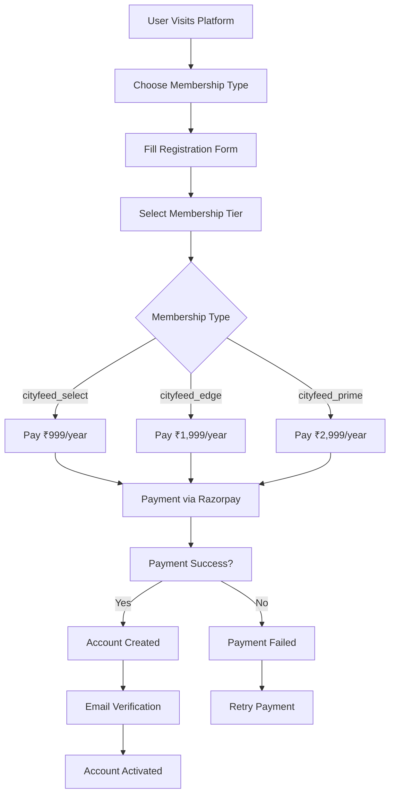
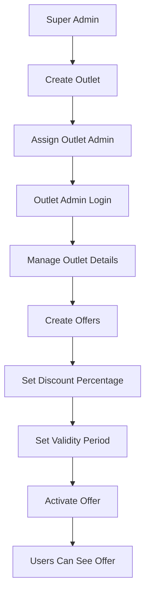
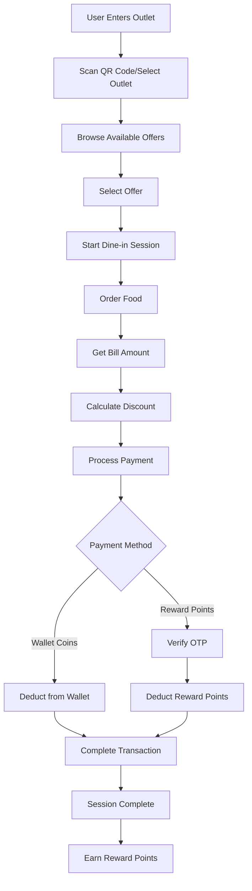
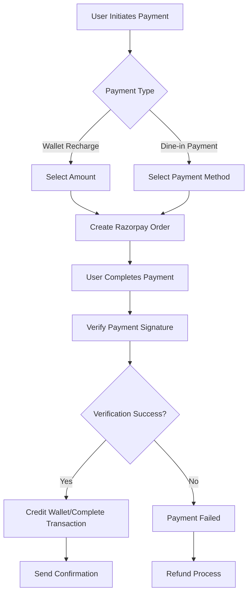

# CityFeed Club - Complete System Flow Documentation

## 📋 Table of Contents
1. [Project Overview](#project-overview)
2. [System Architecture](#system-architecture)
3. [User Roles & Permissions](#user-roles--permissions)
4. [Core Business Flows](#core-business-flows)
5. [Technical Implementation](#technical-implementation)
6. [API Endpoints Overview](#api-endpoints-overview)
7. [Database Schema](#database-schema)
8. [Security & Authentication](#security--authentication)
9. [Payment Integration](#payment-integration)
10. [Deployment & Infrastructure](#deployment--infrastructure)

---

## 🎯 Project Overview

**CityFeed Club** is a comprehensive smart city management platform that connects merchants (outlets) with customers through a membership-based discount system. The platform operates on a coin-based economy where users can redeem offers at participating outlets.

### Key Features:
- **Membership Tiers**: Three membership levels with different benefits
- **Coin System**: Digital currency for transactions
- **Dine-in Experience**: Real-time dining sessions with discounts
- **Multi-role Management**: Super Admin, Outlet Admin, Employee, and User roles
- **Payment Integration**: Razorpay for secure payments
- **Review System**: Customer feedback and ratings

---

## 🏗️ System Architecture

### Technology Stack
```
Frontend: React/Next.js (Client-side)
Backend: Node.js + Express.js + TypeScript
Database: MongoDB with Mongoose ODM
Payment: Razorpay Integration
File Storage: Cloudinary
Authentication: JWT Tokens
Documentation: Swagger/OpenAPI
```

### System Components
```
┌─────────────────┐    ┌─────────────────┐    ┌─────────────────┐
│   Frontend      │    │   Backend API   │    │   Database      │
│   (React App)   │◄──►│   (Node.js)     │◄──►│   (MongoDB)     │
└─────────────────┘    └─────────────────┘    └─────────────────┘
         │                       │                       │
         │                       │                       │
         ▼                       ▼                       ▼
┌─────────────────┐    ┌─────────────────┐    ┌─────────────────┐
│   Cloudinary    │    │   Razorpay      │    │   Email/SMS     │
│   (File Storage)│    │   (Payments)    │    │   (Notifications)│
└─────────────────┘    └─────────────────┘    └─────────────────┘
```

---

## 👥 User Roles & Permissions

### 1. **Super Admin(cityfeed)** 🏢
- **Responsibilities**: Platform management, outlet approval, system configuration
- **Permissions**:
  - Create and manage outlets
  - Approve outlet admin registrations
  - Monitor platform analytics
  - Manage system-wide settings

### 2. **Outlet Admin** 🏪
- **Responsibilities**: Outlet management, offer creation, employee management
- **Permissions**:
  - Manage outlet information
  - Create and manage offers
  - Assign employee roles
  - View outlet analytics

### 3. **Employee** 👨‍💼
- **Responsibilities**: Day-to-day operations, customer service
- **Permissions**:
  - Process dine-in sessions
  - Manage offers (based on assigned responsibilities)
  - Handle customer queries
  - View outlet-specific data

### 4. **User** 👤
- **Responsibilities**: Browse offers, make payments, dine-in experiences
- **Permissions**:
  - Register and manage profile
  - Browse and redeem offers
  - Make payments and recharge wallet
  - Participate in dine-in sessions
  - Leave reviews and feedback

---

## 🔄 Core Business Flows

### Flow 1: User Registration & Membership 🎫



**Membership Benefits:**
- **cityfeed_select**: 2% reward points, up to 20% reward usage
- **cityfeed_edge**: 3% reward points, up to 30% reward usage  
- **cityfeed_prime**: 5% reward points, up to 40% reward usage

### Flow 2: Outlet Management & Offer Creation 🏪



### Flow 3: Dine-in Experience 🍽️



### Flow 4: Payment Processing 💳



---

## ⚙️ Technical Implementation

### Backend Structure
```
src/
├── controllers/     # Business logic handlers
├── models/         # Database schemas
├── routes/         # API endpoints
├── middleware/     # Authentication & validation
├── services/       # Business services
├── repositories/   # Data access layer
├── utils/          # Helper functions
├── config/         # Configuration files
└── types/          # TypeScript definitions
```

### Key Middleware Stack
1. **Authentication**: JWT token verification
2. **Authorization**: Role-based access control
3. **Validation**: Request data validation
4. **Rate Limiting**: API request throttling
5. **Logging**: Request/response logging
6. **Error Handling**: Centralized error management

### Security Features
- **JWT Authentication**: Secure token-based auth
- **Password Hashing**: bcrypt for password security
- **Input Validation**: Express-validator for data sanitization
- **CORS Protection**: Cross-origin request handling
- **Helmet**: Security headers
- **Rate Limiting**: Prevent abuse

---

## 🔌 API Endpoints Overview

### Authentication Routes
```
POST /api/auth/register/user          # User registration
POST /api/auth/login                  # User login
POST /api/auth/verify-email           # Email verification
POST /api/auth/forgot-password        # Password reset
```

### User Management
```
GET    /api/users/profile             # Get user profile
PUT    /api/users/profile             # Update profile
GET    /api/users/wallet              # Get wallet balance
POST   /api/users/recharge            # Recharge wallet
```

### Offer Management
```
GET    /api/offers                    # List all offers
GET    /api/offers/valid-today        # Today's offers
POST   /api/offers                    # Create offer (Admin)
PUT    /api/offers/:id                # Update offer
DELETE /api/offers/:id                # Delete offer
```

### Dine-in Sessions
```
POST   /api/dine-in/session           # Start session
GET    /api/dine-in/user/history      # User history
GET    /api/dine-in/outlet/:id/history # Outlet history
```

### Payment Processing
```
POST   /api/payments/membership/initiate  # Membership payment
POST   /api/payments/dine-in             # Dine-in payment
POST   /api/payments/recharge             # Wallet recharge
```

### Admin Routes
```
GET    /api/admin/dashboard            # Admin dashboard
GET    /api/admin/outlets              # Manage outlets
POST   /api/admin/outlets              # Create outlet
GET    /api/super-admin/analytics      # Platform analytics
```

---

## 🗄️ Database Schema

### Core Entities

#### User Model
```javascript
{
  name: String,
  email: String (unique),
  password: String (hashed),
  membershipType: ['cityfeed_select', 'cityfeed_edge', 'cityfeed_prime'],
  membershipExpiryDate: Date,
  coins: Number (wallet balance),
  reward_points: Number,
  isEmailVerified: Boolean,
  isApproved: Boolean
}
```

#### Outlet Model
```javascript
{
  businessName: String,
  businessType: String,
  category: String,
  address: String,
  location: { coordinates: [Number] },
  defaultMaxDiscount: Number,
  assignedAdmin: ObjectId,
  isActive: Boolean
}
```

#### Offer Model
```javascript
{
  outletId: ObjectId,
  title: String,
  description: String,
  discountPercentage: Number,
  validFrom: Date,
  validTo: Date,
  isActive: Boolean,
  isDefault: Boolean
}
```

#### DineInSession Model
```javascript
{
  userId: ObjectId,
  outletId: ObjectId,
  offerId: ObjectId,
  status: ['pending', 'active', 'completed', 'cancelled'],
  totalBill: Number,
  paymentId: ObjectId
}
```

#### Payment Model
```javascript
{
  userId: ObjectId,
  amount: Number,
  type: ['recharge', 'dine-in', 'refund', 'membership_upgrade'],
  status: ['pending', 'completed', 'failed', 'refunded'],
  paymentMethod: ['wallet', 'razorpay'],
  razorpayOrderId: String
}
```

---

## 🔐 Security & Authentication

### Authentication Flow
1. **Registration**: User provides credentials → Account created → Email verification
2. **Login**: Credentials validated → JWT token generated → Token stored client-side
3. **API Access**: Token included in headers → Server validates → Access granted/denied

### Authorization Matrix
| Role | Users | Offers | Outlets | Payments | Analytics |
|------|-------|--------|---------|----------|-----------|
| User | ✅ Own | ✅ View | ✅ View | ✅ Own | ❌ |
| Employee | ❌ | ⚠️ Limited | ❌ | ❌ | ❌ |
| Outlet Admin | ❌ | ✅ Manage | ✅ Own | ❌ | ✅ Outlet |
| Super Admin | ✅ All | ✅ All | ✅ All | ✅ All | ✅ All |

### Data Protection
- **Encryption**: Passwords hashed with bcrypt
- **Validation**: All inputs sanitized and validated
- **Rate Limiting**: API abuse prevention
- **CORS**: Cross-origin request control
- **HTTPS**: Secure communication (production)

---

## 💰 Payment Integration

### Razorpay Integration
- **Order Creation**: Generate payment orders
- **Payment Processing**: Handle payment completion
- **Signature Verification**: Ensure payment authenticity
- **Webhook Handling**: Real-time payment status updates

### Payment Types
1. **Membership Payment**: One-time annual subscription
2. **Wallet Recharge**: Add coins to user wallet
3. **Dine-in Payment**: Pay for dining experience
4. **Refunds**: Process payment reversals

### Reward Points System
- **Earning**: Percentage of bill amount based on membership
- **Usage**: Discount on future transactions
- **Limits**: Maximum usage percentage by membership tier
- **Verification**: OTP required for reward point usage

---

## 🚀 Deployment & Infrastructure

### Development Environment
```bash
# Local Setup
npm install
npm run dev          # Development server
npm run build        # Production build
npm test             # Run tests
```

### Production Deployment
- **Platform**: Render/Heroku/AWS
- **Database**: MongoDB Atlas
- **File Storage**: Cloudinary
- **Monitoring**: Winston logging
- **Documentation**: Swagger UI at `/api-docs`

### Environment Variables
```env
# Server Configuration
PORT=3000
NODE_ENV=production
BASE_URL=https://api.cityfeedclub.com

# Database
MONGODB_URI=mongodb+srv://...

# JWT
JWT_SECRET=your-secret-key
JWT_EXPIRES_IN=1d

# Payment
RAZORPAY_KEY_ID=your-key
RAZORPAY_KEY_SECRET=your-secret

# Email
SMTP_HOST=smtp.gmail.com
SMTP_USER=your-email
SMTP_PASS=your-password

# File Storage
CLOUDINARY_CLOUD_NAME=your-cloud
CLOUDINARY_API_KEY=your-key
CLOUDINARY_API_SECRET=your-secret
```

---

## 📊 System Monitoring & Analytics

### Logging
- **Request Logging**: All API requests logged
- **Error Logging**: Detailed error tracking
- **Payment Logging**: Transaction monitoring
- **Performance Logging**: Response time tracking

### Analytics Dashboard
- **User Metrics**: Registration, active users, retention
- **Transaction Metrics**: Payment volume, success rates
- **Outlet Metrics**: Performance, offer usage
- **Revenue Metrics**: Platform earnings, growth trends

---

## 🔄 Future Enhancements

### Planned Features
1. **Mobile App**: Native iOS/Android applications
2. **Push Notifications**: Real-time offer alerts
3. **Loyalty Program**: Enhanced reward system
4. **Analytics Dashboard**: Advanced reporting
5. **Multi-language Support**: Internationalization
6. **AI Recommendations**: Personalized offers

### Scalability Considerations
- **Microservices**: Service decomposition
- **Caching**: Redis for performance
- **Load Balancing**: Multiple server instances
- **CDN**: Content delivery optimization
- **Database Sharding**: Horizontal scaling

---

## 📞 Support & Maintenance

### Technical Support
- **API Documentation**: Swagger UI interface
- **Error Handling**: Comprehensive error messages
- **Monitoring**: Real-time system health checks
- **Backup**: Automated database backups

### Maintenance Schedule
- **Security Updates**: Monthly security patches
- **Feature Updates**: Quarterly feature releases
- **Performance Optimization**: Continuous monitoring
- **Database Maintenance**: Weekly optimization

---

*This document provides a comprehensive overview of the CityFeed Club platform. For technical implementation details, please refer to the API documentation at `/api-docs` when the server is running.*

**Document Version**: 1.0  
**Last Updated**: March 2024  
**Prepared By**: Development Team 